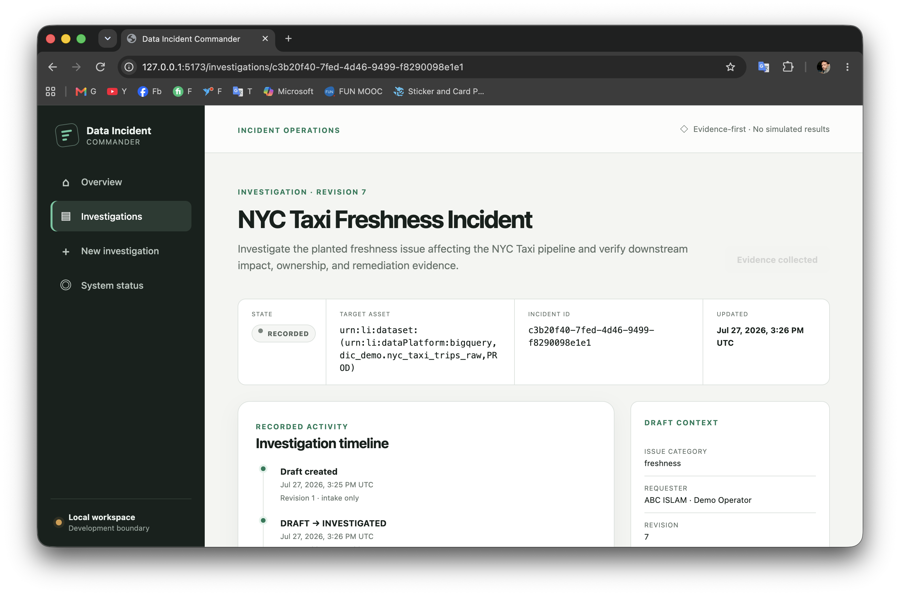
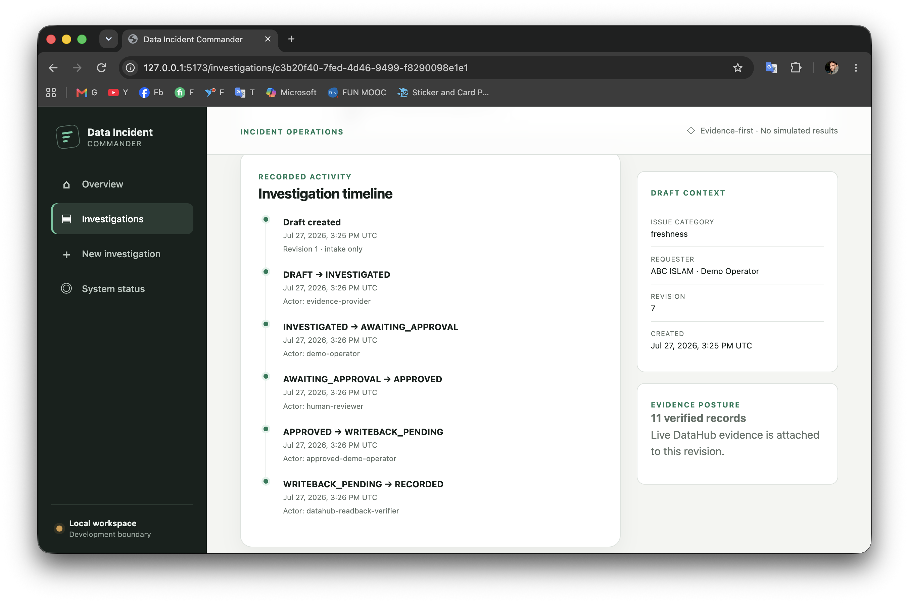
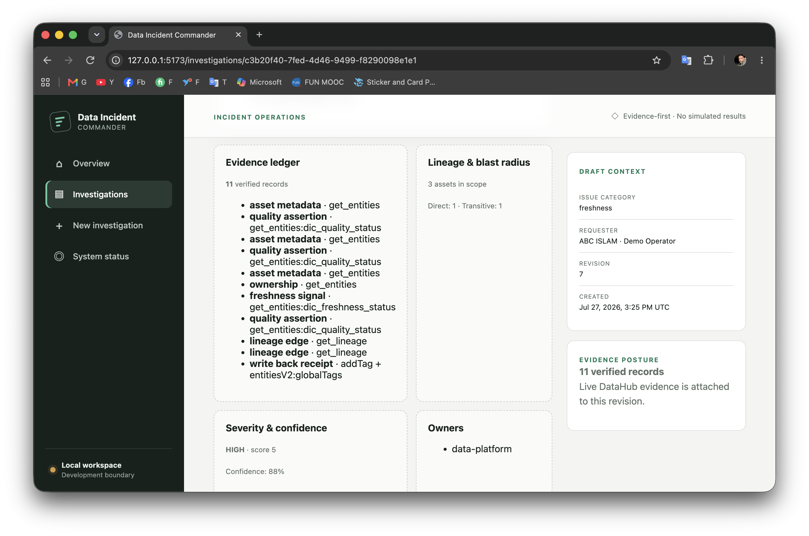
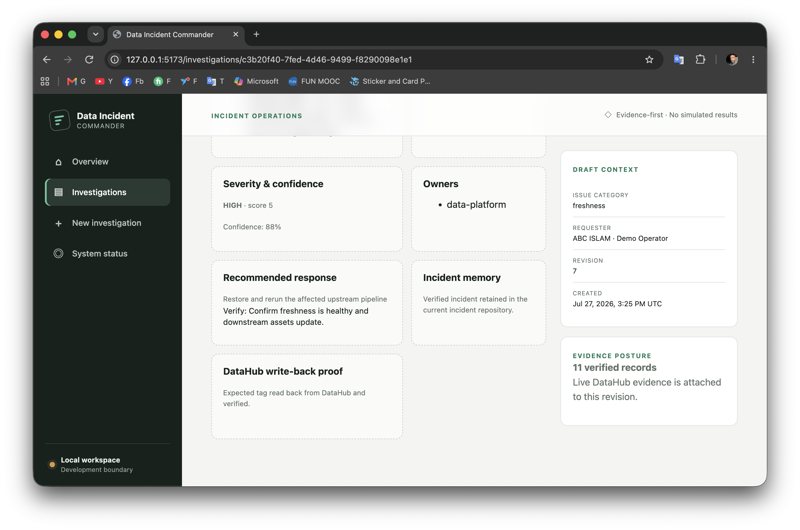

# Data Incident Commander

**Turn a stale-data alert into an evidence-backed, human-approved, and
independently verified incident record.**

Data Incident Commander (DIC) is a DataHub incident-response agent built for
the DataHub Agent Hackathon, **Agents That Do Real Work** category. It connects
catalog evidence to deterministic impact analysis and a controlled remediation
record—without allowing an LLM or an unverified dependency to authorize a
metadata change.

## Live demo

**Public deployment: [http://34.155.33.35](http://34.155.33.35)**

The public deployment was tested end-to-end from the browser. It is hosted
independently: Nginx serves the frontend and proxies the API, the backend runs
through systemd, and the DataHub containers use restart policies. A local Mac
terminal does not need to remain open.

> DIC is a hackathon demonstration, not a claim of production readiness.
> Incident repository state is currently held in memory and does not survive a
> backend process restart. New or misconfigured environments fail closed.

## The problem

When a data product goes stale, responders must jump between catalog search,
ownership, freshness, quality, lineage, and downstream consumers. The work is
slow, conclusions are difficult to audit, and rushed automation can mutate
metadata before a human understands what will be written.

## The solution

DIC turns one incident report into a traceable response record. It retrieves
live DataHub evidence through a verified MCP boundary, calculates bounded blast
radius, deterministic severity, and evidence confidence, recommends an
operational response, pauses for explicit human approval, performs one narrow
DataHub writeback, and reads the result back before recording success.

The differentiator is the separation of responsibilities:

- **DataHub MCP provides evidence:** asset identity, metadata, ownership,
  freshness and quality context, and lineage.
- **Deterministic code makes decisions:** bounded traversal, blast radius,
  severity, and confidence do not depend on an LLM.
- **A human authorizes mutation:** approval binds the exact normalized report
  using SHA-256.
- **DataHub proves the outcome:** the expected tag must be independently read
  back before the incident can reach `RECORDED`.

## Demonstrated end-to-end result

The public browser workflow completed:

```text
DRAFT
  → INVESTIGATED
  → AWAITING_APPROVAL
  → APPROVED
  → WRITEBACK_PENDING
  → RECORDED
```

DataHub evidence collection succeeded through MCP. The application resolved
the NYC Taxi asset, collected typed evidence, calculated direct and transitive
impact, produced deterministic severity and confidence, and recommended a
response. After explicit approval, the controlled DataHub tag write and
independent read-back both succeeded.

### Recorded incident overview



### Complete investigation and approval timeline



### Verified evidence, ownership, and blast radius



### Approval-gated writeback with independent read-back receipt



## Golden demo: NYC Taxi freshness incident

The reproducible fixture contains three assets:

```text
NYC Taxi Trips Raw — stale
  → NYC Taxi Daily Metrics
    → NYC Taxi Operations Dashboard
```

The raw asset carries a planted stale freshness signal. The derived model and
dashboard make downstream impact visible without turning the demonstration
into a data-loading project.

The demonstrated investigation reported 11 verified evidence records, three
assets in scope, one directly affected asset, one transitively affected asset,
high severity with score 5, 88% evidence confidence, and the technical owner
`data-platform`.

## How the complete workflow works

1. A responder reports an incident against a specific DataHub asset.
2. DIC verifies MCP availability, tool inventory, and compatible input schemas.
3. MCP operations resolve the asset and retrieve entity, ownership, signal, and
   bounded lineage evidence.
4. Deterministic engines calculate direct and transitive blast radius, severity,
   and evidence confidence.
5. DIC produces an evidence-linked remediation recommendation.
6. The report is submitted for review, and a human approves the SHA-256 binding
   of the exact normalized report.
7. Only the approved workflow can request the narrow incident-tag write through
   DataHub GMS.
8. DIC reads the persisted `globalTags` aspect back independently.
9. The incident reaches `RECORDED` only when the observed tag matches the
   expected tag.

DIC recommends restoring and rerunning the delayed ingestion, but it does not
alter source data, execute a pipeline, or contact an owner.

## Why DataHub is essential

DataHub is the live system of record for asset identity, ownership, lineage,
freshness and quality context, and the final metadata tag. Without verified
DataHub evidence, DIC refuses to invent a successful investigation.

The demonstrated runtime uses DataHub OSS v1.6.0 and the small NYC Taxi fixture
only to make the judge scenario reproducible.

## MCP reads and controlled GMS writeback

Investigation reads use the standalone `mcp-server-datahub` v0.6.0 server over
stdio. The application validates the runtime tool inventory and compatible
input schemas before enabling evidence collection. Its bounded investigation
path uses:

- `search`
- `get_entities`
- `get_lineage`
- `get_lineage_paths_between`

The mutation path is deliberately separate. A narrow direct-GMS adapter is
disabled by default and becomes available only through explicit runtime
configuration. After approval, it associates the incident tag and reads
`globalTags` back independently. Direct GMS does not replace MCP as the origin
of investigation evidence.

## Architecture

```text
Browser
  → Nginx
    → React/Vite frontend
    → FastAPI application service (systemd)
      → typed incident state machine + in-memory repository
      → deterministic lineage / blast radius / severity / confidence
      → DataHubMcpEvidenceProvider
        → stdio client + runtime inventory/schema gate
          → mcp-server-datahub v0.6.0
            → DataHub OSS v1.6.0
      → approval-gated direct-GMS tag write
        → independent globalTags read-back
```

The backend owns calculations, workflow state, approval history, and
recommendations. DataHub owns catalog evidence and persisted metadata. See
[Architecture](docs/ARCHITECTURE.md) and
[MCP adapter architecture](docs/MCP_ADAPTER_ARCHITECTURE.md).

## Safety model

- **Fail closed:** unavailable, ambiguous, malformed, or unverified evidence
  cannot become a successful investigation.
- **Exact asset resolution:** ambiguous search results are rejected.
- **Bounded lineage:** traversal has explicit depth and node limits.
- **Deterministic decisions:** versioned rules calculate blast radius, severity,
  and confidence separately from any language model.
- **Evidence ledger:** confirmed findings and recommendations refer to typed
  evidence with source operations and timestamps.
- **Human-controlled mutation:** writeback is disabled by default and cannot run
  before review and explicit approval.
- **Approval binding:** the reviewer approves the SHA-256 binding of the exact
  normalized report.
- **Read-back proof:** a successful write alone is insufficient; a mismatch
  cannot reach `RECORDED`.
- **No source-data remediation:** DIC recommends operational action but does not
  change NYC Taxi data or run pipelines.

## Validation

- **Backend:** 423 tests passed.
- **Frontend:** production build passed.

The repository includes focused domain, application, API, MCP integration,
direct-GMS, frontend, deployment-safety, and demo-workflow tests.

## Local development

Prerequisites: Python 3.11+, Node.js/npm, and repository-local dependencies.

```bash
make check
make setup
make test
make integration-test
make frontend-test
make frontend-build
make remote-check
```

Run the application in two terminals:

```bash
# Terminal 1
make api API_HOST=127.0.0.1 API_PORT=8000

# Terminal 2
make frontend FRONTEND_PORT=5173
```

Open `http://127.0.0.1:5173`. An unconfigured local environment supports draft
intake but intentionally reports DataHub/MCP as unavailable. The full workflow
requires a private DataHub runtime, the verified MCP configuration, and
separately enabled writeback. Never commit runtime credentials or private
environment files.

## Demonstrated capabilities and future work

Demonstrated now:

- Browser-based intake through a verified `RECORDED` result.
- Live MCP evidence collection from DataHub.
- Typed evidence ledger, ownership, freshness/quality context, and lineage.
- Bounded blast radius plus deterministic severity and confidence.
- Explicit review and approval bound to the exact report.
- Approval-gated DataHub tag write with independent read-back.
- Public deployment that remains available without a local development
  terminal.

Future work required for production use:

- Replace the in-memory repository with durable storage.
- Add production identity, authentication, authorization, and reviewer roles.
- Add production-grade observability, backup, recovery, and availability
  controls.
- Generalize the demonstration fixture and operational runbooks for additional
  incident types and environments.
- Complete a dedicated security and production-readiness review.

## Submission material

- [Hackathon submission](docs/HACKATHON_SUBMISSION.md)
- [3–4 minute demo script](docs/DEMO_SCRIPT.md)
- [Screenshot plan](docs/SCREENSHOT_PLAN.md)
- [Project charter](PROJECT_CHARTER.md)
- [Test strategy](docs/TEST_STRATEGY.md)

## Scope and independence

DIC does not execute remediation, mutate source data, notify owners, introduce a
general agent platform, or silently choose ambiguous assets. It is a standalone
project with a deliberately bounded demo scenario.

## License

Licensed under the [Apache License 2.0](LICENSE). Secrets, private operational
metadata, and generated runtime state must not be committed.
